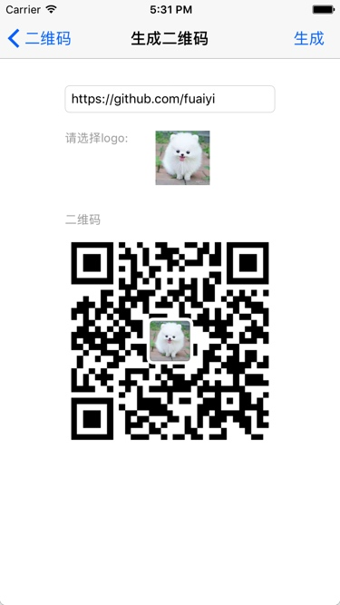

###  一键集成二维码扫描、生成、识别

-------

基于swift3.0

> 1.扫描二维码


设置扫描会话,图层和输入输出   
   

   
   
   
```
   //设置捕捉设备
        let device = AVCaptureDevice.defaultDevice(withMediaType: AVMediaTypeVideo)
        
        do
        {
            //设置设备输入输出
            let input = try AVCaptureDeviceInput(device: device)
            
            let output = AVCaptureMetadataOutput()
            output.setMetadataObjectsDelegate(self, queue: DispatchQueue.main)
            
            //设置会话
            let  scanSession = AVCaptureSession()
            scanSession.canSetSessionPreset(AVCaptureSessionPresetHigh)
            
            if scanSession.canAddInput(input)
            {
                scanSession.addInput(input)
            }
            
            if scanSession.canAddOutput(output)
            {
                scanSession.addOutput(output)
            }
            
            //设置扫描类型(二维码和条形码)
            output.metadataObjectTypes = [
            AVMetadataObjectTypeQRCode,
            AVMetadataObjectTypeCode39Code,
            AVMetadataObjectTypeCode128Code,
            AVMetadataObjectTypeCode39Mod43Code,
            AVMetadataObjectTypeEAN13Code,
            AVMetadataObjectTypeEAN8Code,
            AVMetadataObjectTypeCode93Code]
            
            //预览图层
            let scanPreviewLayer = AVCaptureVideoPreviewLayer(session:scanSession)
            scanPreviewLayer?.videoGravity = AVLayerVideoGravityResizeAspectFill
            scanPreviewLayer?.frame = view.layer.bounds
            
            view.layer.insertSublayer(scanPreviewLayer!, at: 0)
            
            //自动对焦
            if (device?.isFocusModeSupported(.autoFocus))!
            {
                do { try input.device.lockForConfiguration() } catch{ }
                input.device.focusMode = .autoFocus
                input.device.unlockForConfiguration()
            }
            
            //设置扫描区域
            NotificationCenter.default.addObserver(forName: NSNotification.Name.AVCaptureInputPortFormatDescriptionDidChange, object: nil, queue: nil, using: {[weak self] (noti) in
                    output.rectOfInterest = (scanPreviewLayer?.metadataOutputRectOfInterest(for: self!.scanPane.frame))!
            })
            
            //保存会话
            self.scanSession = scanSession
            
        }
        catch
        {
            //摄像头不可用
            
            Tool.confirm(title: "温馨提示", message: "摄像头不可用", controller: self)
            
            return
        }
```

开始扫描

```
       if !scanSession.isRunning
        {
            scanSession.startRunning()
        }
```

扫描结果在代理方法中


```
//扫描捕捉完成
extension ScanCodeViewController : AVCaptureMetadataOutputObjectsDelegate
{
    
    func captureOutput(_ captureOutput: AVCaptureOutput!, didOutputMetadataObjects metadataObjects: [Any]!, from connection: AVCaptureConnection!)
    {
        
        //停止扫描
        self.scanLine.layer.removeAllAnimations()
        self.scanSession!.stopRunning()
        
        //播放声音
        Tool.playAlertSound(sound: "noticeMusic.caf")
        
        //扫完完成
        if metadataObjects.count > 0
        {
            
            if let resultObj = metadataObjects.first as? AVMetadataMachineReadableCodeObject
            {
                
                Tool.confirm(title: "扫描结果", message: resultObj.stringValue, controller: self,handler: { (_) in
                    //继续扫描
                    self.startScan()
                })
                
            }
            
        }
        
    }
    
}

```

> 2.二维码生成
    



> 3.识别二维码


封装接口:

```
   /**
     1.生成二维码
     
     - returns: 黑白普通二维码(大小为300)
     */
    
    func generateQRCode() -> UIImage
    
    
        /**
     2.生成二维码
     
     - parameter size: 大小
     
     - returns: 生成带大小参数的黑白普通二维码
     */
     func generateQRCodeWithSize(size:CGFloat?) -> UIImage
     
     
         /**
     3.生成二维码
     
     - parameter logo: 图标
     
     - returns: 生成带Logo二维码(大小:300)
     */
     func generateQRCodeWithLogo(logo:UIImage?) -> UIImage
     
     
         /**
     4.生成二维码
     
     - parameter size: 大小
     - parameter logo: 图标
     
     - returns: 生成大小和Logo的二维码
     */
    func generateQRCode(size:CGFloat?,logo:UIImage?) -> UIImage
    
    
        /**
     5.生成二维码
     
     - parameter size:    大小
     - parameter color:   颜色
     - parameter bgColor: 背景颜色
     - parameter logo:    图标
     
     - returns: 带Logo、颜色二维码
     */
    func generateQRCode(size:CGFloat?,color:UIColor?,bgColor:UIColor?,logo:UIImage?) -> UIImage
    
    
        /**
     6.生成二维码
     
     - parameter size:            大小
     - parameter color:           颜色
     - parameter bgColor:         背景颜色
     - parameter logo:            图标
     - parameter radius:          圆角
     - parameter borderLineWidth: 线宽
     - parameter borderLineColor: 线颜色
     - parameter boderWidth:      带宽
     - parameter borderColor:     带颜色
     
     - returns: 自定义二维码
     */
    func generateQRCode(size:CGFloat?,color:UIColor?,bgColor:UIColor?,logo:UIImage?,radius:CGFloat,borderLineWidth:CGFloat?,borderLineColor:UIColor?,boderWidth:CGFloat?,borderColor:UIColor?) -> UIImage
    
```


```
/**
     1.识别图片二维码
     
     - returns: 二维码内容
     */
    func recognizeQRCode() -> String?
    {
            
        let detector = CIDetector(ofType: CIDetectorTypeQRCode, context: nil, options: [CIDetectorAccuracy : CIDetectorAccuracyHigh])
        let features = detector?.features(in: CoreImage.CIImage(cgImage: self.cgImage!))
        guard (features?.count)! > 0 else { return nil }
        let feature = features?.first as? CIQRCodeFeature
        return feature?.messageString
        
    }
```


使用(建议使用子线程)


```  
DispatchQueue.global().async {
                
let image = content.generateQRCodeWithLogo(logo: self.logoImageView.image)
                DispatchQueue.main.async(execute: {
                    self.QRCodeImageView.image = image
                })
                
            }
```


```
DispatchQueue.global().async {
            let recognizeResult = self.sourceImage?.recognizeQRCode()
            let result = recognizeResult?.characters.count > 0 ? recognizeResult : "无法识别"
            DispatchQueue.main.async {
                Tool.confirm(title: "扫描结果", message: result, controller: self)
                self.activityIndicatoryView.stopAnimating()
            }
        }
```


详情请查看我的博客:[二维码扫描、生成、识别 (swift3.0)](http://www.jianshu.com/p/93d7a4b9b8f6)  
如果碰到有什么问题欢迎给我留言


